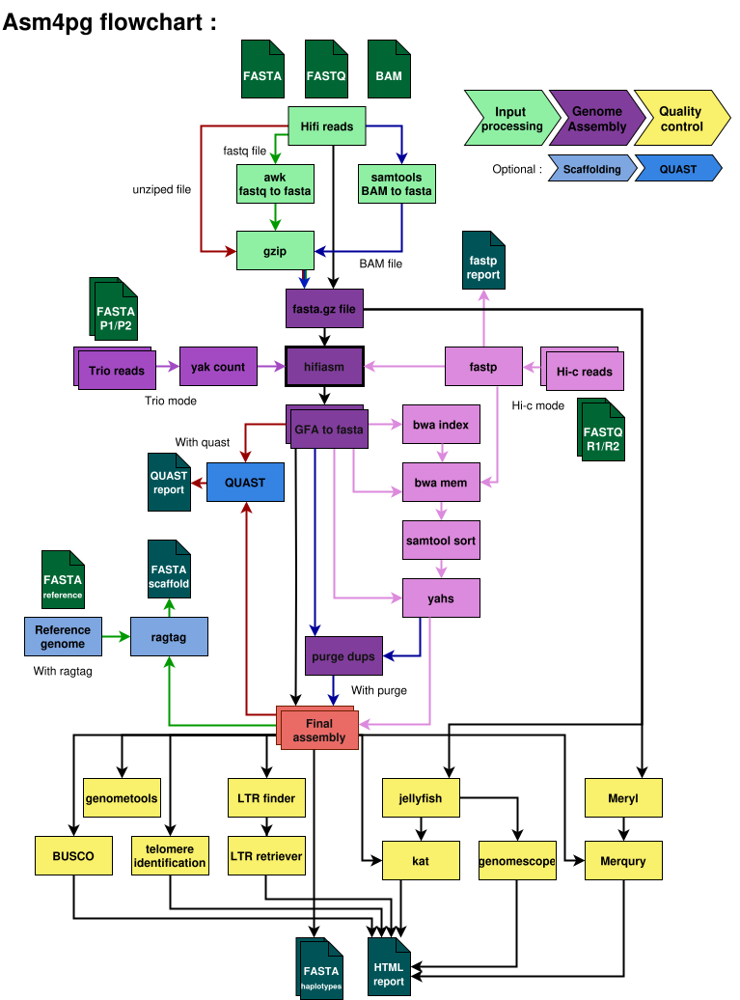

# [Asm4pg](https://forgemia.inra.fr/asm4pg/GenomAsm4pg)  

**Asm4pg** is an **automatic and reproducible genome assembly workflow** designed for **pangenomic applications** using **PacBio HiFi data**.  

This workflow leverages **[Snakemake](https://snakemake.readthedocs.io/en/stable/)** for efficient genome assembly and generates an **HTML report** summarizing key assembly statistics.  

**Asm4pg** can assamble in :
- **HiFi mode (default)**  
  Performs primary genome assembly using high-fidelity long reads.

- **hi-c mode**  
  Uses Hi-C data to scaffold the assembled contigs into chromosome-scale scaffolds.

- **trio mode**  
  Uses parental short reads to partition long reads by haplotype before assembly.

- **ont mode**  
  Uses ultra long reads (in fastq or bam format, no fasta) to perform the assembly 

&nbsp;
  
[Animated version](https://asm4pg-animated-7dc863.pages.mia.inra.fr/asm4pg_animated.html) 
## 📂 Repository Structure  

```bash
├── README.md
├── asm4pg  # <- The running script
├── doc
├── workflow
│   ├── scripts
|   └── Snakefile
└──  .config
    ├── snakemake_profile
    └── masterconfig.yaml # <- Your configuration
```

## ✅ Requirements  

- **Miniforge/conda (for Snakemake>=8.4.7 and the SLURM plugin)**
- **Singularity/Apptainer** (for containerized execution)  

> **Note:** All external [tools](doc/software_list.md) are automatically managed by Snakemake and will be downloaded as Singularity/Apptainer images (~6GB total).  

---

## 🚀 How to Use (quick guide)
### 1. Set up

Clone the Git repository
```bash
git clone https://forgemia.inra.fr/asm4pg/GenomAsm4pg.git && cd GenomAsm4pg && mkdir slurm_logs
```

- Create an environement for snakemake (from the provided envfile): 
```bash
conda env create -n wf_env -f .config/wf_env.yaml
```  
> Use Miniforge with the conda-forge channel, see why [here](https://science-ouverte.inrae.fr/fr/offre-service/fiches-pratiques-et-recommandations/quelles-alternatives-aux-fonctionnalites-payantes-danaconda) (french)

- Update the `asm4pg` file with the correct paths to **Singularity/Apptainer** modules lines 45-46
```bash
nano asm4pg
```
> You can configure this file for multiple servers using the case statement (see the example for genotoul HPC line 33)

### 2. Configure the pipeline for your data
- Edit the `masterconfig` file in the `.config/` directory with your sample information. 
```bash
nano .config/masterconfig.yaml
```
- Here you can add the path to your long reads file (fasta.gz, fasta, fastq.gz, fastq, or bam)
- Update the path to the output directory parent directory
- We advise keeping the default [options](doc/going_further.md) for the first run.

Example config : 
```yaml
samples:       
  example1:              # <- First indent = Name of the assembly
    reads: example-1.fasta.gz    # <- Second indent = All options
    busco_lineage: insecta_odb10
  example2: 
    reads: example-2.fasta.gz
    busco_lineage: eudicots_odb10 # Options only affect current assembly
```
### 3. Run the workflow 

- Run the workflow :
```bash
sbatch asm4pg dry # Check for warnings
sbatch asm4pg run # Then
```
> **Nb :** If your account name can't be automatically determined, add it in the `.config/snakemake/profiles/slurm/config.yaml` file.

> **Nb :** Use the command `squeue --format="%.10i %.9P %.6j %.10k %.8u %.2t %.10M %.6D %.20R" -A $user` to see job **names**
## ⚙️ Other runing options
```
asm4pg [dry|run|local-run|dag|rulegraph|unlock|touch] [additional snakemake args]
    dry - run in dry-run mode
    run - run the workflow with SLURM
    local-run - run the workflow localy (on a single node)
    dag - generate the directed acyclic graph for the workflow
    rulegraph - generate the rulegraph for the workflow
    unlock - Unlock the directory if snakemake crashed
    touch - Tell snakemake that all files are up to date (use with caution)
    [additional snakemake args] - for any snakemake arg, like --until hifiasm
```
## 🔧 Using the full potential of the workflow :
Asm4pg has many options. If you wish to modify the default values and know more about the workflow, please refer to the [documentation](doc/documentation.md)

## Output of the workflow :

```bash
└── sample
    └── results
        ├── 00_converted_input
        ├── 01_raw_assembly
        │   ├── sample.fasta.gz
        │   └── sample.gfa
        ├── 02_final_assembly
        │   ├── hap1/hap2 
        │   │   ├── sample.fasta.gz # <- The final assembly
        │   │   └── ragtag_scafold
        ├── 03_raw_data_qc
        │   ├── genometools
        │   ├── genomescope
        │   └── jellyfish
        ├── 04_assembly_qc
        │   ├── hap1/hap2
        │   │   ├── genometools
        │   │   ├── busco
        │   │   ├── katplot
        │   │   ├── LTR/LAI
        │   │   └── telomeres
        │   ├── merqury
        │   │   ├── ...
        │   │   └── meryl_database.meryl
        │   └── quast
        ├── final_report.html # <- The final report
        ├── benchmark
        └── logs
```

## 📜 How to cite asm4pg?

Waiting for the publication, you can cite asm4pg as follow: 

Denni S\*, Piat L\*, Bouallegue S, Tran J, Smith K, Wu C, Klopp C, Bui QT, Duvaux L.  Asm4pg: a workflow for efficient long-read genome assembly for pangenomics (In prep.). https://forgemia.inra.fr/asm4pg/GenomAsm4pg

\* This authors contributed equally to this work.


## License
The content of this repository is licensed under <A HREF="https://choosealicense.com/licenses/gpl-3.0/">(GNU GPLv3)</A> 

## ✉️ Contacts
For any troubleshooting, issue or feature suggestion, please use the issue tab of this repository.
For any other question or if you want to help in developing asm4pg, please contact Ludovic Duvaux at ludovic.duvaux@inrae.fr
