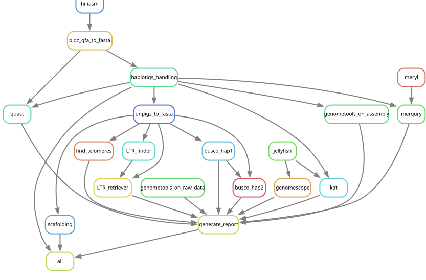

# [Asm4pg](https://forgemia.inra.fr/asm4pg/GenomAsm4pg)  

**Asm4pg** is an **automatic and reproducible genome assembly workflow** designed for **pangenomic applications** using **PacBio HiFi data**.  

This workflow leverages **[Snakemake](https://snakemake.readthedocs.io/en/stable/)** for efficient genome assembly and generates an **HTML report** summarizing key assembly statistics.  

  

## 📂 Repository Structure  

```
├── README.md
├── job.sh
├── local_run.sh
├── doc
├── workflow
│   ├── scripts
|   └── Snakefile
└──  .config
    ├── snakemake_profile
    └── masterconfig.yaml
```

## ✅ Requirements  

- **Miniforge (or Snakemake>=8.4.7 localy)**
- **Singularity/Apptainer** (for containerized execution)  

> **Note:** All external tools are automatically managed by Snakemake and will be downloaded as Singularity/Apptainer images (~6GB total).  

---

## 🚀 How to Use  
### 1. Set up
Clone the Git repository
```bash
git clone https://forgemia.inra.fr/asm4pg/GenomAsm4pg.git && cd GenomAsm4pg
```
### 2. Configure the pipeline
- Edit the `masterconfig` file in the `.config/` directory with your sample information. 
```bash
nano .config/masterconfig.yaml
```
- Here you can add the path to your reads file (fasta.gz, fasta, fastq.gz, fastq, or bam)
- Update the path to the output directory parent directory
- We advise keeping the default [options](doc/going_further.md) for the first run.

### 3. Run the workflow 

#### <ins>A. On a HPC (SLURM)</ins>
- Update `asm4pg` file with the correct paths to Singularity/Apptainer and Miniforge.
- Provide and environment with `Snakemake` and `snakemake-executor-plugin-slurm` in `asm4pg` file, under `source activate wf_env`, you can create it like this : 
```bash
conda create -n wf_env -c conda-forge -c bioconda snakemake=8.4.7 snakemake-executor-plugin-slurm
```  
> Use Miniforge with the conda-forge channel, see why [here](https://science-ouverte.inrae.fr/fr/offre-service/fiches-pratiques-et-recommandations/quelles-alternatives-aux-fonctionnalites-payantes-danaconda) (french)
- Add the log directory for SLURM 
```bash
mkdir slurm_logs
```
- Run the workflow :
```bash
sbatch asm4pg dry # Check for warnings
sbatch asm4pg run # Then
```
> **Nb 1:** If your account name can't be automatically determined, add it in the `.config/snakemake/profiles/slurm/config.yaml` file.

## Other runing options
```
asm4pg [dry|run|local-run|dag|rulegraph|unlock]
    dry - run in dry-run mode
    run - run the workflow with SLURM
    local-run - run the workflow localy (on a single node)
    dag - generate the directed acyclic graph for the workflow
    rulegraph - generate the rulegraph for the workflow
    unlock - Unlock the directory if snakemake crashed
```
## 🔧 Using the full potential of the workflow :
Asm4pg has many options. If you wish to modify the default values and know more about the workflow, please refer to the [documentation](doc/documentation.md)

## 📜 How to cite asm4pg?

We are currently writing a publication about asm4pg. Meanwhile, if you use the pipeline, please cite it using the address of this repository. 

## License
The content of this repository is licensed under <A HREF="https://choosealicense.com/licenses/gpl-3.0/">(GNU GPLv3)</A> 

## ✉️ Contacts
For any troubleshooting, issue or feature suggestion, please use the issue tab of this repository.
For any other question or if you want to help in developing asm4pg, please contact Ludovic Duvaux at ludovic.duvaux@inrae.fr
