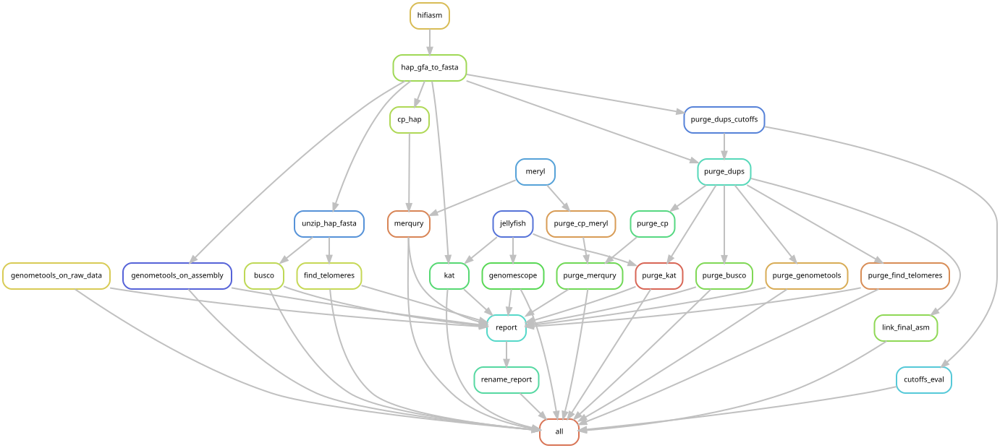

# <A HREF="https://forgemia.inra.fr/asm4pg/GenomAsm4pg"> asm4pg </A>

Asm4pg is an automatic and reproducible genome assembly workflow for pangenomic applications using PacBio HiFi data.

[TOC]

## Asm4pg Requirements
- snakemake >= 6.5.1
- singularity

The workflow does not work with HPC that does not allow a job to run other jobs.

## Tutorials
The three assembly modes from hifiasm are available.
- [Quick start (default mode)](doc/Quick-start.md)
- [Hi-C mode](doc/Assembly-Mode/Hi-C-tutorial.md)
- [Trio mode](doc/Assembly-Mode/Trio-tutorial.md)

## Outputs
[Workflow outputs](doc/Outputs.md)

## Optional Data Preparation
If your [data is in a tarball](doc/Tar-data-preparation.md)

## Known errors
You may run into [these errors](doc/Known-errors.md)

## Softwares
[Softwares used in the workflow](doc/Programs.md)
